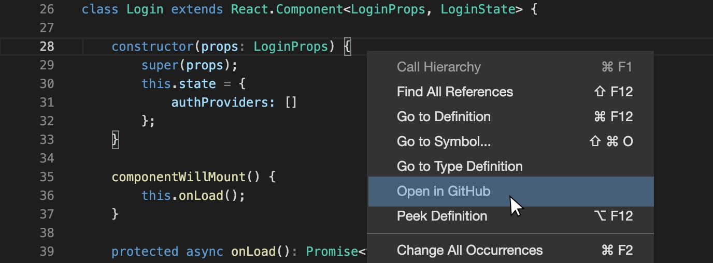

# February Release 2019 🎉

We are close to leaving the beta phase and with that are also approaching a more regular schedule of releases.
This means we are going to have monthly updated release notes. It will pop up only once and you easily close them by pressing <kbd>[ESC]</kbd>.
If you want to look up the release notes later you can open them through the command palette <kbd>[F1]</kbd>. Search for 'Release Notes'.

So here are the new & noteworthy things that we have been hard at work at this time.

## GitHub Navigation

You can now navigate to GitHub from any file or editor. The corresponding GitHub URL for a given editor position can be copied to the cliboard so it can be used e.g. in GitHub issues or Pull Request comments.



## Snapshots

In addition to live sharing a running Gitpod workspace, you can now take a snapshot. Snapshots capture the current state of a workspace session including the UI layout and the file changes. Anyone who has a snapshot link can create a fresh workspace based on that.

This is super handy for providing reproducibles for GitHub issues and StackOverflow posts. They are also great to prepare trainigs, tutorials, or to just showcase stuff you have thrown together.

Please see this [blog post](https://medium.com/gitpod/code-never-lies-creating-reproducibles-for-any-programming-language-7946021a68f2) as well as the corresponding section in the [documentation](https://docs.gitpod.io/33_Sharing_and_Collaboration.html#sharing-snapshots) for more details.


## Configuration

The possibilities to fine-tune the developer experience when using Gitpod on your repository have been improved in various ways. Here are the features you can define in your `.gitpod.yml`:

### Tasks
You can now specify multiple tasks. Each will open in its own terminal view on start. You can even specify where those terminals whould be opened.
The following config, for instance, will make sure that the two terminals are opened next to each other.

```yaml
tasks:
 - command: echo 'left'
 - command: echo 'right'
   openMode: split-right
```


### Lifecycles

In addition we have introduced multiple lifecycle phases for the tasks. The main purpose is to avoid reruning unnecessary commands such as full builds, when restarting workspaces or starting snapshots.

### Ports

You can now specify the default behavior on port detection. By default users get a notification when starting a server, asking whether they want to open a web view or an external browser.

This behavior can no be configured so users are not bothered with annoying notifications.

Check out [the docs](https://docs.gitpod.io/44_Config_Start_Tasks.html) for all the possibilities.

## YAML Support

Gitpod now understands YAML syntax and uses json schema specifications to validate and guide developers. While this works for any YAML files it comes in especially handy when editing `.gitpod.yml`.


## Gitpod CLI

The CLI for Gitpod has learned new tricks. Please check out all the cool things you can do with it by typing `gp help`.

Here are the new commands that we recently added.

### gp init

To get the best experience with Gitpod, you should configure your repository to have the right tools, run the right commands on start, etc. This information is stored in y `.gitpod.yml` file sitting in your repositories root.

The `gp init` command walks you through the basic setup and generates a `.gitpod.yml` and if desired a corresponding `Dockerfile`.

```sh
gitpod /workspace/my-repo $ gp init
Use the arrow keys to navigate: ↓ ↑ → ←
? Workspace Docker image:
  ▸ default
    custom image
    docker file
```

More information about `.gitpod.yml` configuration can be found in the [docs](https://docs.gitpod.io/40_Configuration.html).

### gp url

One of the things you do in a `.gitpod.yml` is declaring the exposed ports. Gitpod maps them to a specific subdomain in order to make them accessible. For instance if you have a dev server running on `0.0.0.0:3000` the `gp url` command gives you the external url for that service.

Here is an example:
```sh
gitpod /workspace/release-notes $ gp url 3000
https://3000-b33f605e-b32a-4e44-ae5a-acad9641de0a.ws-eu0.gitpod.io/
```

`gp url` can also give you the URL of the workspace itself:
```sh
gitpod /workspace/release-notes $ gp url
https://b33f605e-b32a-4e44-ae5a-acad9641de0a.ws-eu0.gitpod.io/
```

### gp preview

`gp preview` is similar to `gp open`, except that it does not open a file in the editor but a URL in a preview pane on the right.

This is especially handy together with `gp url` if you want to open a specific path from a script.

Here's an example:
```sh
gp preview $(gp url 3000)my/special/path.html
```

## Improved Docker Performance

In addition to the `.gitpod.yml` you can provide a `Dockerfile` which is automatically picked up by Gitpod. See this blog post for more informtion on thise [feature](https://medium.com/gitpod/bring-your-own-docker-image-to-gitpod-52db1aa861de).

Since we launches this feature the performance and logging for docker builds have been improved significantly.

## Java Debugging

In addition to Node.js one can now also launch and debug Java applications from with the editor. Code lense actions on `main()` methods will automatically use the right classpath from the current project's settings (based on maven, gradle or eclipse classpath information).

Launch configs are stored in a VS Code compatible `launch.json` file.


## XML Support

The new improved XML support not only does syntax highlighting for XML and XSD but also uses associated schemas to provide diagnostics, content assist and hover information.


## Better Previews

Previews can now easily be opened by clicking on the top right icon () on any preview enabled files, such as Markdown, HTML or SVG files.

The inverse is supported, too. I.e. clicking the file icon on the top right of a preview will open the corresponding editor on the left. For Markdown even scrolling is synced between the two views.

## AsciiDoc Support

In addition to Markdown, Gitpod now also supports previewing AsciiDoc as you type.


## Many Bugfixes, small features and other improvements

These are just the most noteworthy features we have been working on.
For a more detailed list of bugfixes and enhancemenst see the closed issues

 - [Closed Issues in Gitpod](https://github.com/gitpod-io/gitpod/issues?utf8=%E2%9C%93&q=is%3Aissue+is%3Aclosed+closed%3A%3E2018-11-01)
 - [Merged PRs in Theia](https://github.com/theia-ide/theia/pulls?utf8=%E2%9C%93&q=merged%3A%3E2018-11-01+merged%3A%3C2018-02-13+)